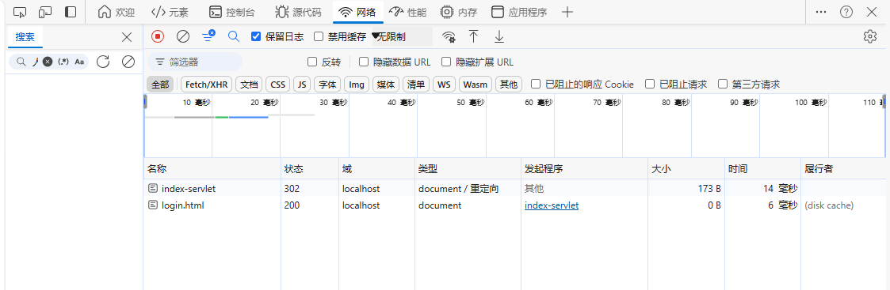
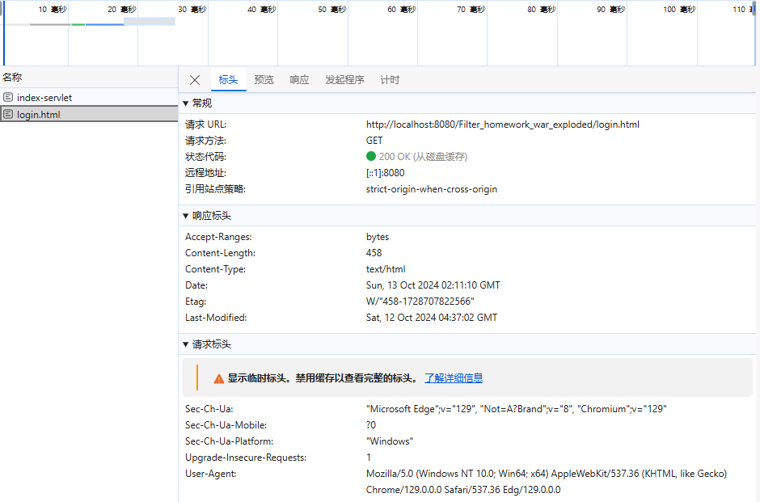
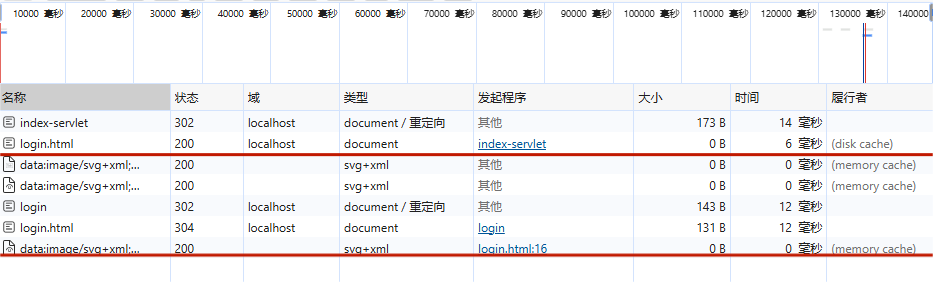
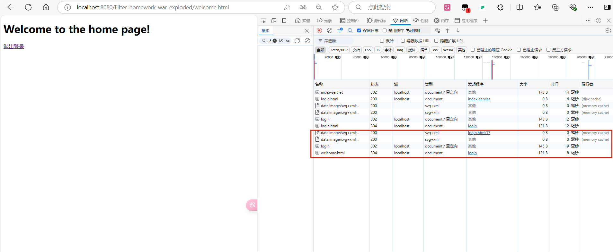
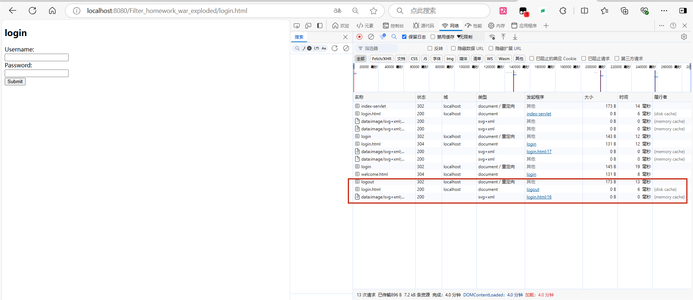
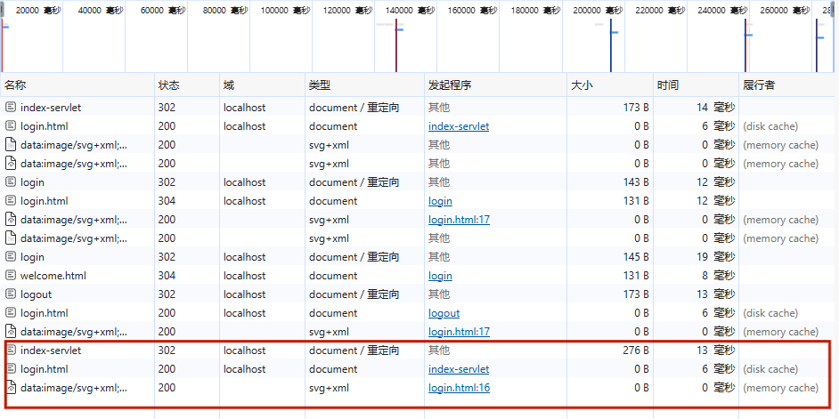

# 《Filter练习》
> **学院：  省级示范性软件学院**
>
> **课程：  JavaWeb后端开发技术**
>
> **题目：** 《Filter练习》
>
> **姓名：**  郭研棋
>
> **学号：**  2200770285
>
> **班级：**  软工2202
>
> **日期：**  2024-10-12
>
> **实验环境：**  Intelij IDEA
# 一、实现步骤
1. 利用IndexServlet访问welcome页面，以验证是否能直接访问。
2. 创建LoginFilter实现javax.servlet.Filter接口。在doFilter方法中，明确需要接受检查的资源以及实现用户登录检测。若用户已登录则让请求继续，未登录则重定向回到login页面。
3. 使用LoginServlet验证用户名和密码，用户名及密码正确则跳转至welcome页面，错误则重定向回到login页面。
4. 使用LogoutServlet处理退出登录请求，清除Session中的用户信息，并重定向到登录页面。
# 二、实现功能
## 1.页面访问
（1）在未登录时禁止访问welcome页面
使用/index-servlet访问welcome页面无法成功

（2）在未登录时允许访问login页面

## 2.登录
（1）用户信息错误时重定向回login页面

（2）用户信息正确后跳转至welcome页面

## 3.退出登录
（1）在welcome页面退出登录后清除session信息，跳转到login页面

（2）退出登录后再次使用/index-servlet无法访问welcome页面，退出登录成功

