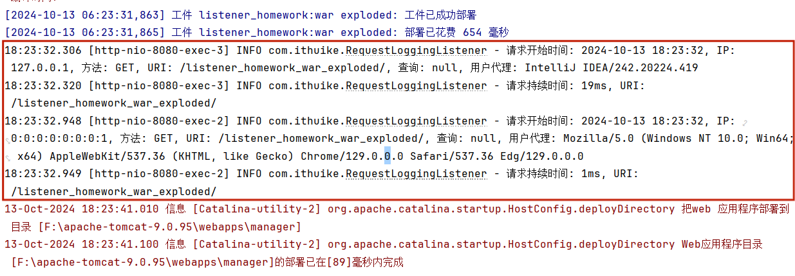
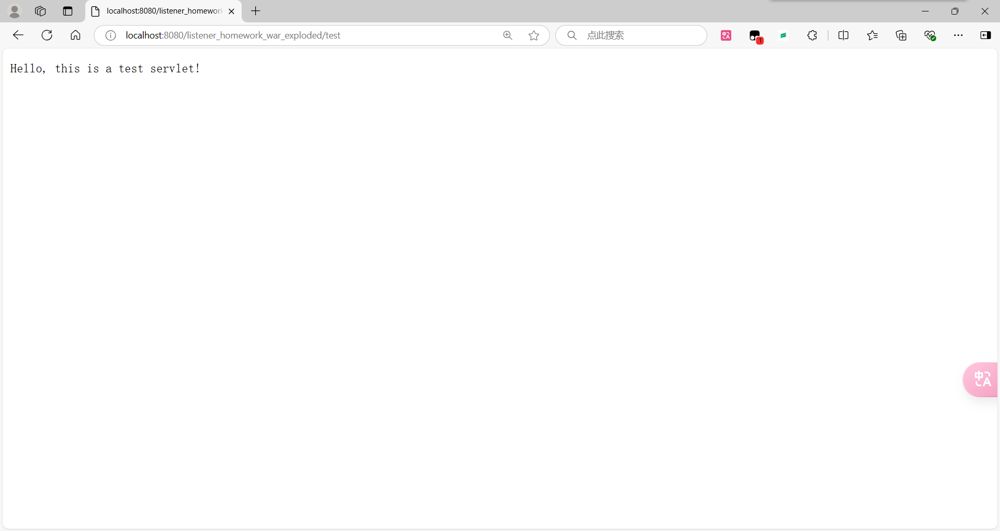
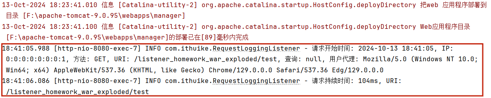

# Listener练习

> **学院：  省级示范性软件学院**
>
> **课程：  JavaWeb后端开发技术**
>
> **题目：** 《Listener练习》
>
> **姓名：**  郭研棋
>
> **学号：**  2200770285
>
> **班级：**  软工2202
>
> **日期：**  2024-10-13
>
> **实验环境：**  Intelij IDEA

# 一、实现步骤

1. 创建RequestLoggingListener类实现ServletRequestListener接口的，监听每个请求的还是和结束。

2. 以logger记录日志信息

3. 在requestInitialized方法中获取HTTP请求信息，包括请求开始时间、IP、方法、URI、查询、用户代理，并使用logger.info记录一条日志。

4. 当Servlet销毁请求处理完成后使用requestDestroyed方法，从请求属性中获取请求开始的时间。计算请求处理时间，并将完整的请求信息记录到日志中。再次使用logger.info记录一条日志，包括请求完成时间、持续时间和URI。

5.  创建 Servlet进行测试。触发请求以验证日志记录功能。

   

# 二、实现功能

记录HTTP请求信息，包括请求开始时间、IP地址、请求方法、URI、查询、用户代理、请求持续时间并输出以便于查看

启动服务器，初始访问信息记录成功

利用Servlet类进行测试，信息记录成功

